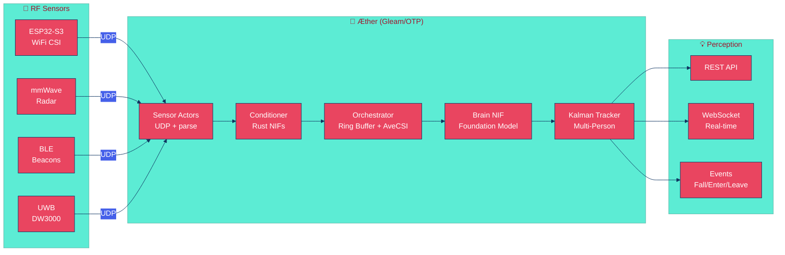
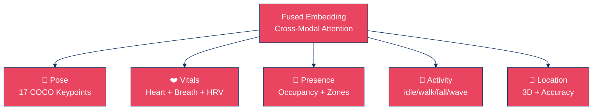

<div align="center">


[](https://gleam.run/)
[](https://www.rust-lang.org/)
[](https://www.erlang.org/)
[](./test)
[](./LICENSE)

**Sees without cameras. Hears without microphones. Knows without asking.**

---

*"The æther is not empty. It is full of perception."*

</div>

---

> [!IMPORTANT]
> **Æther is the first RF sensing system built in Gleam/OTP.**
> It turns invisible radio waves — WiFi, BLE, UWB, radar — into human perception:
> pose, vital signs, presence, activity. No cameras. No wearables. Just physics.

---

## ⚡ Quick Start

```gleam
import aether
import aether/core/types.{Zone}
import aether/sensor

let assert Ok(hub) =
  aether.space("home")
  |> aether.add_zone(Zone("sala", "Sala", #(0.0, 0.0, 5.0, 4.0), 0.0, 3.0))
  |> aether.add_sensor(sensor.wifi_csi(
    host: "192.168.1.50", port: 5000,
    antennas: 3, subcarriers: 56, sample_rate: 100,
  ))
  |> aether.with_api(8080)
  |> aether.start()
```

```bash
curl localhost:8080/api/perceptions
```

```json
{
  "perceptions": [
    {"type": "pose", "keypoints": [...], "skeleton": "coco17", "confidence": 0.92},
    {"type": "vitals", "heart_bpm": 72.3, "breath_bpm": 16.1, "hrv": 45.2},
    {"type": "presence", "total_occupants": 2},
    {"type": "activity", "label": "walking", "confidence": 0.85}
  ]
}
```

## 🏗️ Architecture



| Property | Value |
|:---------|:------|
| **Language** | Gleam + Rust NIFs + Erlang FFI |
| **Runtime** | BEAM/OTP 28 |
| **Tests** | 72 passing |
| **Latency** | < 15ms end-to-end |
| **Lines** | 5,800+ (Gleam, Rust, Erlang, C) |

---

## 🔬 Signal Processing (Rust NIFs)

Algorithms validated in 2025-2026 research papers:

| NIF | Algorithm | Paper | Scheduler |
|:----|:----------|:------|:---------:|
| `tsfr_calibrate` | Phase unwrap + detrend + Savitzky-Golay | TSFR (2023) | Normal |
| `hampel_filter` | Outlier detection via MAD | Standard DSP | Normal |
| `butterworth_bandpass` | Zero-phase IIR cascaded biquads | Standard DSP | Normal |
| `savgol_filter` | Polynomial least-squares smoothing | Savitzky-Golay (1964) | Normal |
| `avecsi_stabilize` | Sliding window frame averaging | CSIPose (IEEE TMC 2025) | Normal |
| `spotfi_aoa` | MUSIC-based AoA estimation | SpotFi (SIGCOMM 2015) | Normal |
| `foundation_infer` | Multi-task foundation model | AM-FM / X-Fi (2026) | DirtyCpu |
| `cross_modal_fuse` | Attention-weighted sensor fusion | X-Fi (2025) | DirtyCpu |

> Signal NIFs run on normal BEAM schedulers (< 1ms).
> Brain NIFs run on dirty CPU schedulers to avoid blocking.

---

## 🧠 Foundation Model

One model. Five decoder heads. Any RF modality.



| Decoder | Output | Inspired by |
|:--------|:-------|:------------|
| **Pose** | 17 keypoints + velocity | GraphPose-Fi, VST-Pose (2025) |
| **Vitals** | Heart BPM, breath BPM, HRV | PulseFi (2025), RoSe (2026) |
| **Presence** | Zone occupancy count | AM-FM (2026) |
| **Activity** | Label + confidence | X-Fi (2025) |
| **Location** | 3D position + accuracy (m) | Geometry-Aware (2026) |

---

## 🎯 Multi-Person Tracking

- **Kalman filter** per person per axis (x, y, z) — smooths noisy RF measurements
- **Nearest-neighbor association** — links detections to tracked persons (< 2m threshold)
- **Dead reckoning** — predicts position between frames using estimated velocity
- **Stale removal** — drops persons not seen for configurable timeout
- **Zone events** — `PersonEntered`, `PersonLeft`, `FallDetected`, `VitalsAlert`

---

## 🌐 API

### REST

```
GET  /api/health        → {"status": "ok", "version": "0.1.0", "name": "aether"}
GET  /api/perceptions   → {"perceptions": [...], "count": 5}
GET  /api/sensors       → {"sensors": [...]}
```

### WebSocket

```
ws://localhost:8080/ws/stream → real-time perception push (JSON)
```

Supports `ping` → `pong` heartbeat. Perceptions are pushed automatically via OTP subject subscription.

---

## 📡 Supported Sensors

| Sensor | Transport | Signal Type | Capabilities |
|:-------|:---------:|:------------|:-------------|
| **ESP32-S3** | UDP | WiFi CSI (56 subcarriers) | Pose, vitals, presence, through-wall |
| **IWR6843** | UDP | mmWave range-Doppler | Micro-movements, vitals, gesture |
| **DW3000** | UDP | UWB CIR | Centimeter-level localization |
| **BLE beacons** | UDP | RSSI | Coarse room-level presence |
| **Any WiFi** | UDP | RSSI (degraded) | Basic presence detection |
| **Custom** | UDP/Serial/TCP | User-defined | Extensible via `UserDefinedSignal` |

<details>
<summary><strong>🔧 ESP32 Firmware</strong></summary>

Included in `firmware/esp32-csi-node/`. Captures WiFi CSI (LLTF + HTLTF + STBC) and streams via UDP.

```bash
cd firmware/esp32-csi-node
idf.py menuconfig  # Set WiFi SSID, password, hub IP, port
idf.py build
idf.py -p /dev/ttyACM0 flash monitor
```

Configurable via Kconfig: SSID, password, hub IP, hub port, sample rate.

</details>

---

## 📚 Research Foundation

Built on state-of-the-art 2025-2026 papers:

| Paper | Year | Key Contribution |
|:------|:----:|:-----------------|
| **AM-FM** | 2026 | Foundation Model for Ambient Intelligence Through WiFi |
| **X-Fi** | 2025 | Cross-modal transformer — 24.8% MPJPE reduction |
| **WiFlow** | 2026 | Lightweight axial attention + TCN for pose |
| **CroSSL** | 2026 | Station-wise masking for sensor robustness |
| **GraphPose-Fi** | 2025 | Per-antenna GCN + self-attention decoder |
| **VST-Pose** | 2025 | Velocity-Integrated Spatio-Temporal Attention |
| **CSIPose** | 2025 | AveCSI stabilization for through-wall sensing |
| **PulseFi** | 2025 | ESP32 CSI heart rate pipeline |
| **LatentCSI** | 2025 | CSI → Stable Diffusion latent space |
| **Diffusion²** | 2026 | 3D environments → RF heatmaps |

---

## 🏛️ OTP Supervision

```
Space (Supervisor) ── OneForOne
├── Orchestrator (worker)
│   ├── Ring Buffer (AveCSI stabilization)
│   └── Brain NIF (foundation model)
├── SensorSupervisor
│   ├── Sensor("esp32-sala") + UDP listener
│   ├── Sensor("esp32-quarto") + UDP listener
│   └── Sensor("radar-entrada") + UDP listener
├── PerceptionAggregator
│   ├── Kalman Tracker (per-person state)
│   └── Zone Manager (transition events)
└── ApiServer (Mist HTTP/WS)
```

> Sensor crashes → only that sensor restarts.
> Orchestrator crashes → restarts fresh, sensors auto-reconnect via bridge.
> Brain NIF crashes → dirty scheduler isolates, supervisor restarts.

---

## 📂 Project Structure

```
aether/
├── src/aether.gleam                  # Public API — space() |> add_sensor() |> start()
├── src/aether/
│   ├── core/                         # Types (Vec3, Zone, Signal), errors, math
│   ├── sensor/                       # OTP actors, UDP listener, CSI frame parser
│   ├── condition/                    # Pipeline (NIF-wired), ring buffer, AveCSI
│   ├── fusion/                       # Temporal sync, cross-modal fusion engine
│   ├── orchestrator.gleam            # Heart — signal → condition → brain → perception
│   ├── track/                        # Kalman filter, aggregator, zone events
│   ├── serve/                        # REST API, WebSocket streaming, JSON codec
│   └── nif/                          # Gleam FFI bindings to Rust NIFs
├── native/
│   ├── aether_signal/                # Rust NIF: TSFR, Hampel, Butterworth, SpotFi
│   └── aether_brain/                 # Rust NIF: foundation model (5 decoders)
├── test/                             # 72 tests across all layers
└── firmware/esp32-csi-node/          # ESP32-S3 CSI capture + UDP streaming
```

---

## 🛠️ Build

<details>
<summary><strong>📋 Prerequisites</strong></summary>

| Tool | Version |
|:-----|:--------|
| Gleam | `>= 1.14` |
| Erlang/OTP | `>= 28` |
| Rust | `>= 1.94` |
| ESP-IDF | `>= 5.x` (optional, for firmware) |

</details>

```bash
# Clone
git clone https://github.com/gabrielmaialva33/aether.git && cd aether

# Build Gleam
gleam build

# Build Rust NIFs
make nif

# Test everything
gleam test
# 72 passed, no failures

# Run
gleam run
```

---

## 📊 Stats

| Metric | Value |
|:-------|------:|
| **Gleam modules** | 21 |
| **Rust modules** | 11 |
| **Erlang FFI modules** | 6 |
| **Total lines** | 5,800+ |
| **Tests** | 72 |
| **Rust tests** | 14 |
| **API endpoints** | 3 + WebSocket |
| **Signal NIFs** | 6 |
| **ML decoder heads** | 5 |

---

## 📜 License

MIT

---

<div align="center">


*Built with invisible waves and visible ambition.*

</div>
